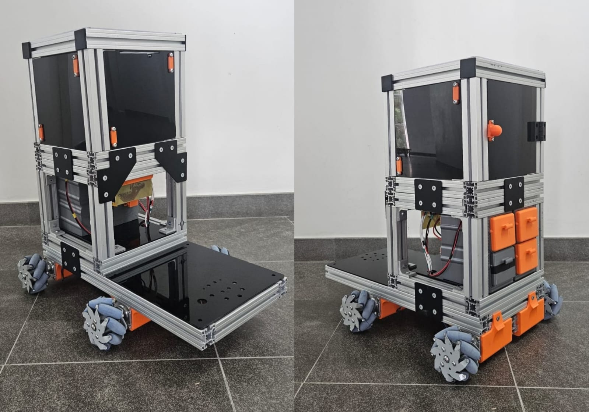

# [Open MICKY🤖](https://open-micky.readthedocs.io/en/latest/)

 

---

## 💵 Total Cost 💵

> [!NOTE] 
> Cost excludes 3D printing, tools, shipping, and taxes.

| Price | R$ | US | EU |
| --- | --- | --- | --- |
| Structural | ~R$949.62 | ~$184.16 | ~€158.78 |
| Motion System | ~R$3140 | ~$608.95 | ~€525.01 |
| Eletronics | ~R$1133.01 | ~$219.73 | ~€189.44 |
| **Total** | **~R$5222.63** | **~$1012.84** | **~€873.22** |

---

## 🚀 Get Started 🚀

> [!NOTE] 
> If you are totally new to programming, please spend at least a day to get yourself familiar with basic Python, Ubuntu and Github (with the help of Google and AI). At least you should know how to setup ubuntu system, git clone, pip install, use intepreters (VS Code, Cursor, Pycharm, etc.) and directly run commands in the terminals.

1. 💵 **Buy your parts**: [Bill of Materials](https://open-micky.readthedocs.io/en/latest/hardware/getting_started/material.html)
<!--2. 🖨️ **Print your stuff**: [3D printing](https://open-micky.readthedocs.io/en/latest/hardware/getting_started/3d.html)
# 3. 💻 **Software**: [Get your robot moving!](https://xlerobot.readthedocs.io/en/latest/software/index.html)
-->
---